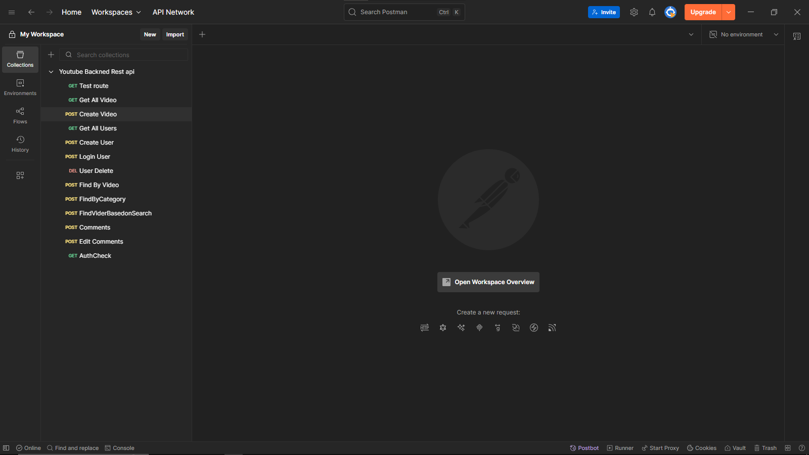

# Backend_Youtube Project

This is a backend API project built as part of the **Internshala Full Stack Developer with DSA** program. It features a Node.js and Express.js server with MongoDB as the database. The project includes 15 fully functional RESTful APIs for CRUD operations and demonstrates clean architecture using controllers, routes, middleware, and models.

## 🔧 Tech Stack

- **Node.js**
- **Express.js**
- **MongoDB + Mongoose**
- **dotenv**
- **bcrypt**
- **jsonwebtoken**
- **cors**
- **nodemon (Dev only)**

## 📁 Project Structure

.
├── controllers # Logic handlers for API endpoints
├── db # Database connection setup
├── module # Mongoose models/schemas
├── routes # Route definitions
├── .env # Environment variables
├── .gitignore
├── app.js # Main entry point
├── package.json
├── package-lock.json
└── README.md

## 🚀 Features

- ✅ 15 REST APIs (CRUD)
- ✅ JWT Authentication
- ✅ Middleware support
- ✅ Password hashing using bcrypt
- ✅ MongoDB connection with Mongoose
- ✅ Clean modular structure
- ✅ Environment variable management

## 📦 Installation

1. **Clone the repository:**
   ```bash
   git clone https://github.com/nitin01010/Backend_Youtube.git
   cd Backend_Youtube
   ```


